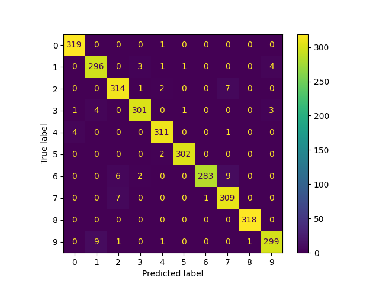

# SpeechCommandsBERT
This project implements a transformer-based model for single-word speech classification using the Google Speech Commands dataset. Inspired by BERT and Whisper, the model processes log-mel spectrograms as inputs and classifies them into predefined speech commands. The model uses a modified version of [Andrej Karpathy's reproduction of GPT-2 (124M)](https://github.com/karpathy/build-nanogpt 'build-nanogpt').

The following loss curve was generated from training for 200 steps on the Google Speech Commands v0.02 dataset, using an NVIDIA GeForce RTX 5070 Ti:

  

The Google Speech Commands v0.02 dataset consists of 36 different spoken words. Among these, 10 are considered core commands: "Yes", "No", "Up", "Down", "Left", "Right", "On", "Off", "Stop", and "Go". The remaining 26 words, such as "Tree", "Cat", "Bird", "Dog", "Wow", and "silence", help the model learn to distinguish meaningful commands from unrelated or background audio. This structure is designed to improve robustness by teaching the model not only what to recognize, but also what to ignore.

The model currently achieves **95.20% accuracy** on the test set when classifying 4,074 recordings from the first 10 command classes.

Below is the confusion matrix demonstrating the model's ability to predict these 10 command words on the test set:

  

