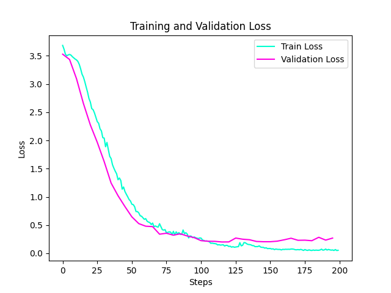

# SpeechCommandsBERT
This project implements a transformer-based model for single-word speech classification using the Google Speech Commands dataset. Inspired by BERT and Whisper, the model processes log-mel spectrograms as inputs and classifies them into predefined speech commands. The model uses a modified version of [Andrej Karpathy's reproduction of GPT-2 (124M)](https://github.com/karpathy/build-nanogpt 'build-nanogpt').

The following loss curve was generated from training for 200 steps on the Google Speech Commands v0.02 dataset, using an NVIDIA GeForce RTX 5070 Ti:

  

